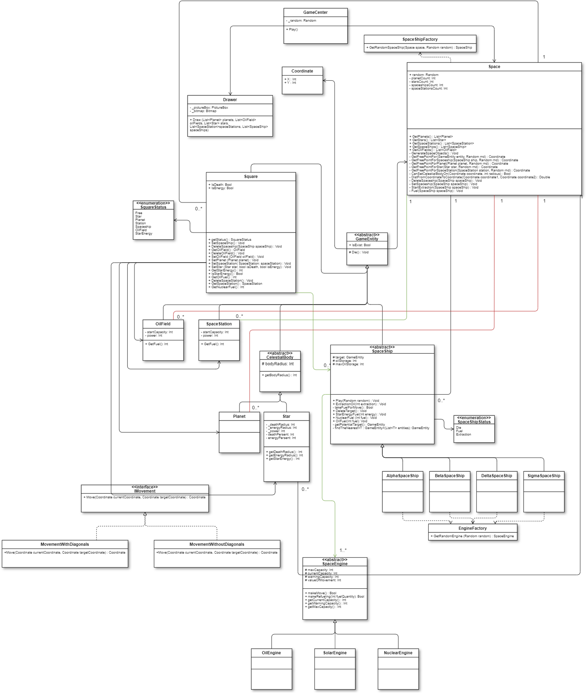

<h1>HITs_2Grade_OOP-Retake</h1>

<h2>Задание</h2>

Ваша задача - разработать симуляцию освоения космоса, где космические корабли могут исследовать галактику.

    Игровое пространство в симуляции заполняют небесные тела (планеты и звёзды), космические станции и космические корабли. 
    
    
    Планеты и звёзды представляют собой круглые тела разных размеров. Для простоты считаем, что оба - неподвижны.
    В разных местах планеты находится нефть, которую можно накапливать в хранилище корабля и использовать в качестве топлива.
    Звёзды излучают солнечную энергию на определённом радиусе от себя. То, сколько энергии будет отдавать звезда раз в ход, 
    определяется показателем "мощности". При этом на другом, более близком, радиусе моментально уничтожают любой космический корабль, 
    подошедший достаточно близко. Все планеты и звёзды должны отличаться друг от друга, то есть генерироваться по какому-то алгоритму 
    с элементами рандома. Не должно быть такого, что все звёзды имеют радиус 20 клеток, дают энергию в радиусе 10 клеток,
    а сжигают на расстоянии 4 клеток, и что на всех планетах месторождения нефти находятся в одних и тех же местах.
    Можете придумать свою иерархию звёзд и планет, если считаете, что она будет уместна. 
    
    
    Следующие объекты в симуляции - космические корабли. Корабли могут свободно перемещаться по галактике, 
    тратя на каждую пройденную точку определённое количество энергии. Энергия может быть трёх видов: солнечная, нефтяная и ядерная. 
    В кораблях есть двигатели, которые расходуют энергию и делятся на те же три вида. 
    У каждого двигателя есть показатели текущей и максимальной заполненности. Когда энергия в одном из двигателей достигает нуля, 
    корабль останавливается (или продолжает медленно двигаться по инерции в одном направлении), пока не будет использован другой двигатель, 
    где ещё есть топливо, либо пока запас энергии в этом двигателе не будет пополнен. Пополнение происходит следующим образом:
    1) Нефтяной двигатель - берётся часть запасов нефти, находящихся на данном корабле
    2) Солнечный двигатель - необходимо оказаться в радиусе передачи энергии какой-либо звезды. 
    Раз в ход энергия солнечного двигателя будет пополняться на показатель мощности звезды
    3) Ядерный двигатель - пополняется с помощью ядерного топлива, получаемого на космических станциях
    
    В игре должно присутствовать минимум три вида космических кораблей. Виды различаются по следующим показателям:
    1) Общее количество нефти, которую можно хранить на борту
    2) Доступные виды двигателей и их максимальное общее количество. Т.е. может быть корабль, 
    куда можно устанавливать всего два двигателя, причём только нефтяных, другой - максимум с тремя, но любого вида, третий - всего с одним ядерным.
    3) Алгоритм передвижения корабля, то есть то, каким путём он летит из точки А в точку Б.
    
    Чтобы организовать добычу нефти, корабль должен оказаться на планете над месторождением (некая область произвольной формы, 
    где есть какое-то количество нефти) и раз в секунду выкачивать из него какое-то количество нефти. 
    Выкачанная нефть попадает в хранилище корабля или напрямую в двигатель (если у корабля установлен хотя бы один нефтяной двигатель). 
    Месторождение, где не осталось нефти, исчезает с карты.
    
    
    Также в галактике существуют космические станции - объекты, где корабли могут пополнять свои ядерные двигатели. 
    Общая цель для космических кораблей, по которой можно выстраивать их логику - добыть как можно больше нефти. 
    Чтобы пронаблюдать это во всей красе, сделайте объёмы хранилища корабля в разы большими, чем среднее количество нефти на одной планете.
    
    Вам необходимо как реализовать рабочее приложение, так и сделать диаграмму классов системы.

<h2>Диаграмма</h2>
